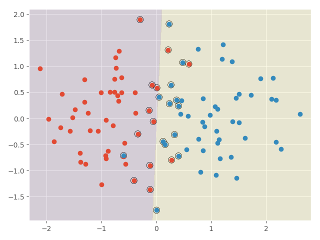
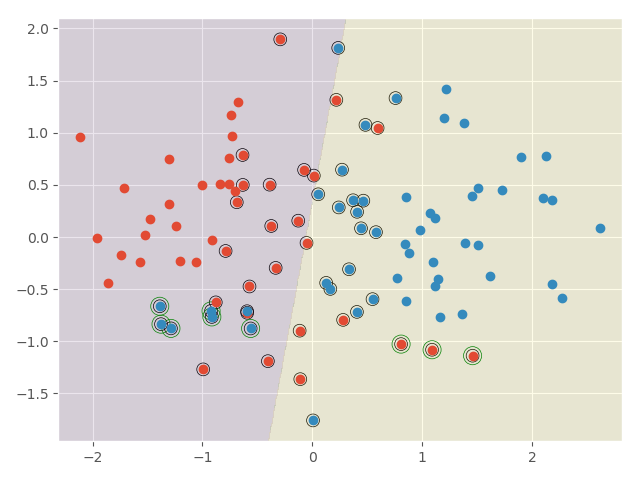

# LN-robust SVM

Try to reproduce  [support vector machines under adversarial label noise](http://proceedings.mlr.press/v20/biggio11/biggio11.pdf). 

## About Adversarial label flip attack

- run `python data.py` can produce the following results.  

- Follow  Adversarial label flip attack algorithm,  the training result on untainted toy data is 

, the  training result on tainted toy data is 
.  

I am not sure whether it is correct. 

- I guess $v_i \leftarrow C-\beta_1 s_1 - \beta_2 s_2$ in the algorithm should be $v_i \leftarrow C - |\beta_1 s_1 - \beta_2 s_2|$. 

- May I ask how to generate random SVM, i.e., the range of uniform distribution. It seems that the hyperplane of random SVM tend to vertical, e.g., w=[38.58336261  0.53190985]^T, which make the random SVM and training error almost the same when repeating the R times. 

