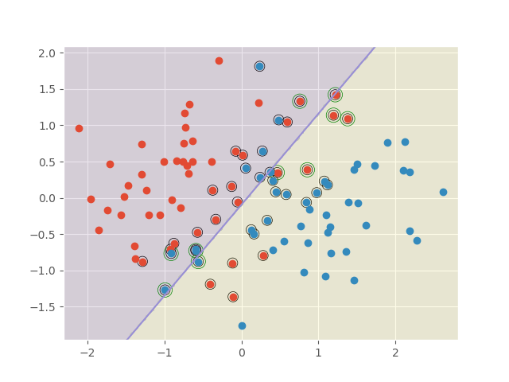

# LN-robust SVM

Try to reproduce  [support vector machines under adversarial label noise](http://proceedings.mlr.press/v20/biggio11/biggio11.pdf). 

## About Adversarial label flip attack

- run `python data.py` can produce the following results.  

- Follow  Adversarial label flip attack algorithm, 

 
the training result on untainted toy data is 

, the training result on tainted toy data is 
.  

with mu=0.5 and LN-svm, we learned 

